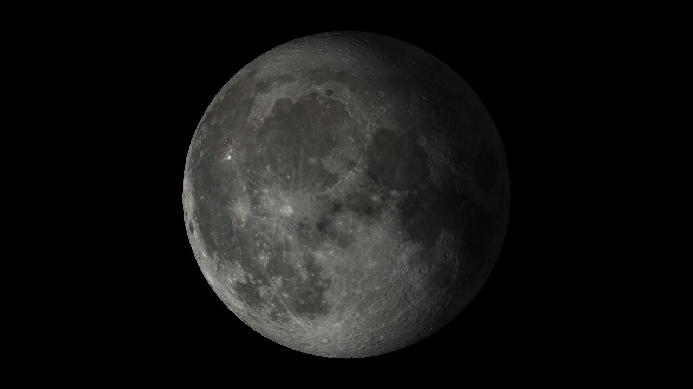

# Macroexpand Noj LWJGL

Small example program using LWJGL's OpenGL bindings to render data from the [NASA CGI Moon Kit](https://svs.gsfc.nasa.gov/4720/).



Run it likes this.
On the first run the program will download color and elevation data from the CGI Moon Kit.

```Shell
clj -M moon.clj
```

You can click and drag to rotate the Moon.

[](https://www.youtube.com/watch?v=UdTs5tH3DxQ)
